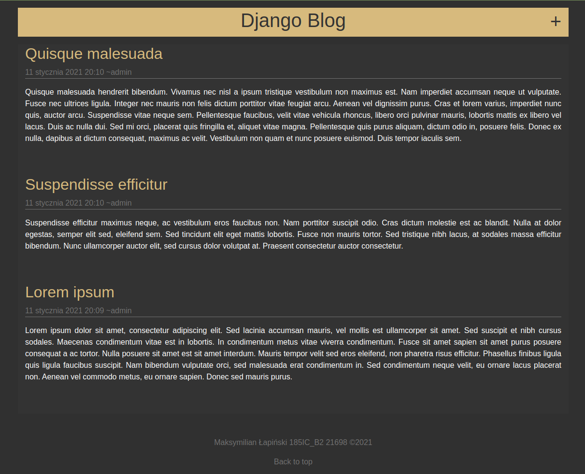
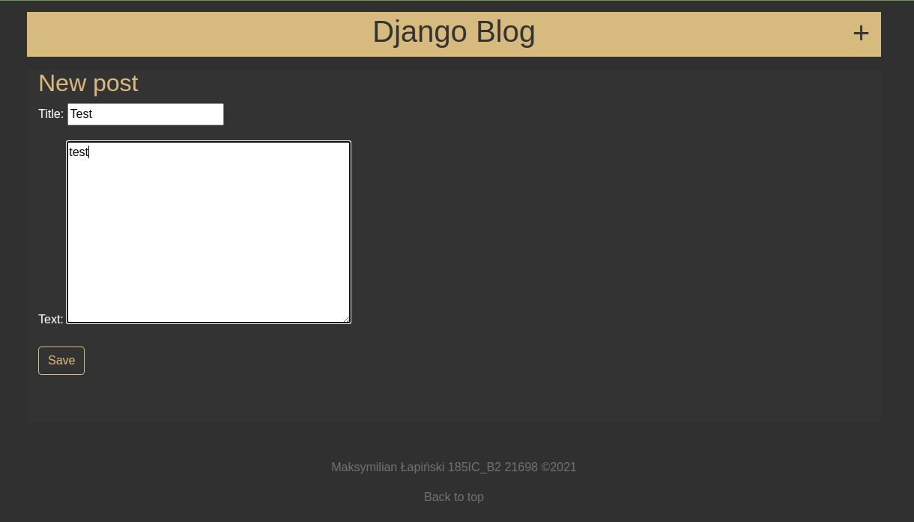
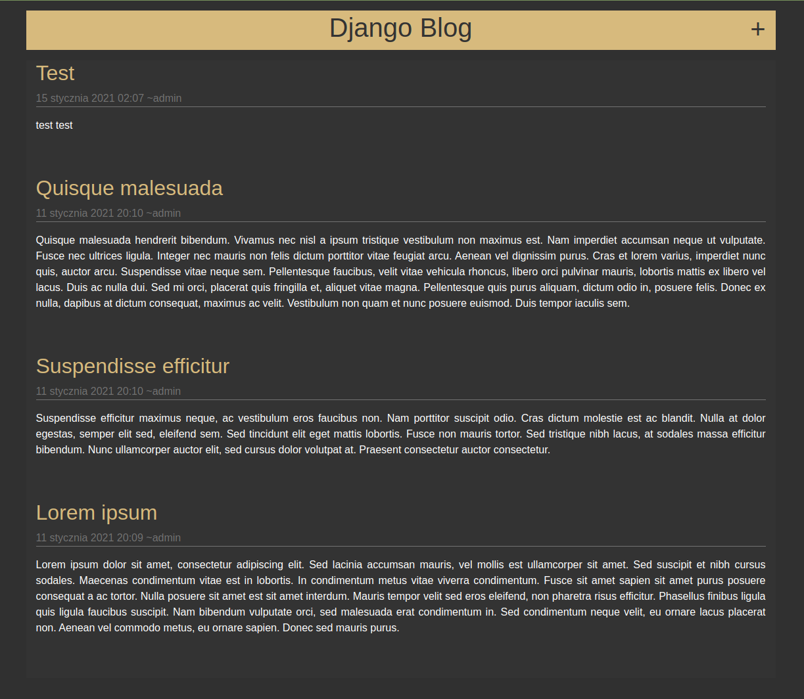
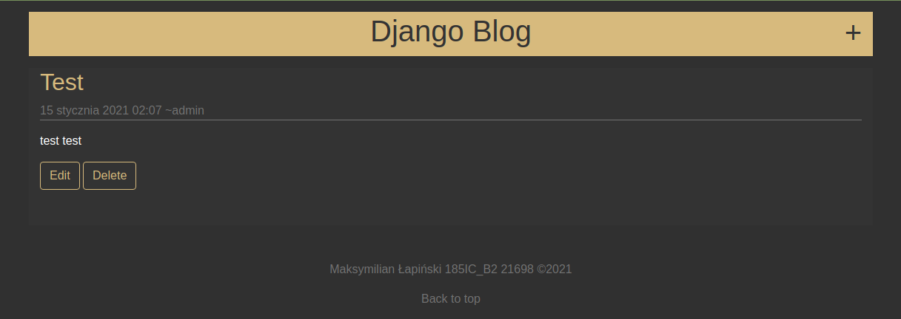

# Lab_1

**Cel:**
- utworzyć blog według [Kursu Django Girls](https://tutorial.djangogirls.org/pl/)
- poniższe zagadnienia powinny zostać zrealizowane:
  - instalacja pakietów i tworzenie projektu,
  - korzystanie z serwera deweloperskiego,
  - modele, migracje i ORM,
  - ustawienia projektu,
  - tworzenie superusera i panel admina,
  - tworzenie aplikacji w Django,
  - QuerySets i menadżery obiektów,
  - praca z plikami views.py, urls.py i szablonami,
  - praca z formularzmi (dodawanie edycja i usuwanie postów)

Widok listy postów przed dodaniem posta

Widok formularza dodania nowego posta

Widok listy postów po dodaniu nowego posta

Szczegółowy widok posta

# heroku-blog
